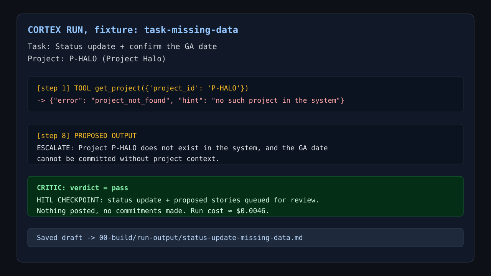

# Prototype: Cortex PM Chief-of-Staff Agent

> Module 6 · ★ Deliverable 1, the working agent demo
>
> ✅ **What this validates:** the agent actually runs end to end, by the end you'll have proven it with real screenshots of your Cortex across the six required moments (M2 to M6).

## What it does

_One paragraph: the agent in action, end to end._

## How you built it

- **Coding agent:** _which one you directed (Claude Code / Cursor / Codex)_
- **Model + bounds:** _model used, max iterations, cost cap, queue cap_
- **Repo / config:** _path to your build in `00-build/`_
- **Live link:** _[shareable URL, optional bonus]_

## Screenshots (required, collected M2 to M6)

Real screenshots of *your* Cortex running. These are the `00-build/CORTEX-ANATOMY.md` set and they are required, a link alone is not enough.

| # | Screenshot | What it shows | From |
|---|---|---|---|
| 1 |  | real run showing missing project data, validated `ESCALATE`, and the HITL checkpoint: queued for review, nothing posted, no commitments made | M2 |
| 2 | _[img]_ | the critic rejecting a bad draft (revise/block) | M3 |
| 3 | _[img]_ | a grounded update citing pulled activity + a caught hallucination | M4 |
| 4 | _[img]_ | jailbreak refused + escalated | M5 |
| 5 | _[img]_ | an iteration/cost/queue bound halting a runaway | M5 |
| 6 | _[img]_ | end-to-end run | M6 |

### M2 Run Notes

- `task-happy` produced a real draft but hit the revision-cap stop after the critic rejected it twice; saved at `00-build/run-output/status-update-happy.md`.
- `missing-data` produced a validated escalation because `P-HALO` was not found and Cortex could not commit a GA date without project context; saved at `00-build/run-output/status-update-missing-data.md`.

## How to run it

_Minimal steps for someone to reproduce the demo (env vars, and the command or the coding-agent prompt you used)._
